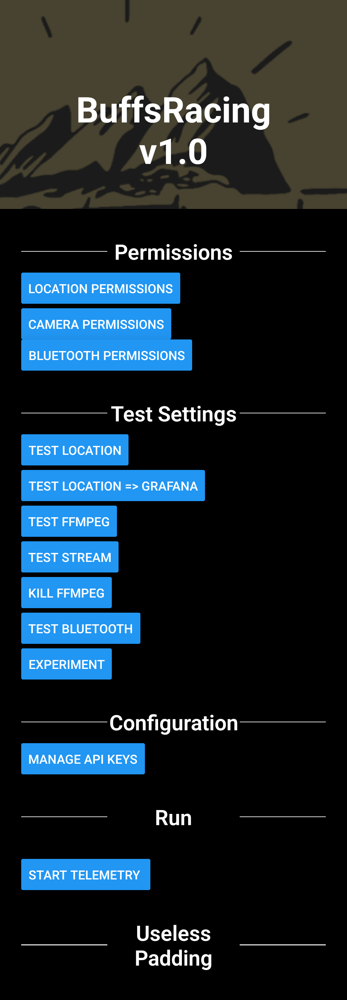

<div align="center">

# BuffsControl


</div> 
<hr>

## About

BuffsControl is a mobile app for real-time streaming and telemetry.

Current features include:

* Streaming Data to Grafana
  * GPS Coordinates
  * Data from OBD-2 using OBD2REST
* Live Streaming
  * Any RTMP URL (Tested with Twitch)

## Screenshots

<details>
<summary>Click to open</summary>
<br>

### iOS 


### Android




</details>

## Building

Dependencies can be installed using yarn

```
yarn install
```

### Android

```
npx react-native run-android
```

### iOS

```
npx react-native run-ios --device
```

## Misc

### Generating app logo

```
npx react-native set-icon --path ./cropped.png --background white --platform <android/ios>
```

### macOS -> Android Specific Shenanigans

Install the correct version of android-sdk (Tested with Homebrew version) and Java (Tested with OpenJDK version 8)

```
export JAVA_HOME="/Library/Java/JavaVirtualMachines/adoptopenjdk-8.jdk/Contents/Home"
export ANDROID_SDK_ROOT="/usr/local/share/android-sdk/"
```


